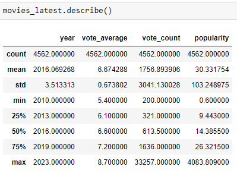

# TMDB-10000-Movies-Dataset-Analysis
This project analyzes the imdb data set to find insights containing 10000 rows and 8 columns before cleaning. The first step is to clean the data before proceeding. I have considered the following steps.
1. Remove the unwanted column.
2. Identify null values and treat them.
3. Find the duplicates and remove them.
4. Treat columns to make them useful.
I have considered analyzing the data by dividing the data set based on their release date and the language they have released.
The data set is subdivided into 4 subsets.
1. Movies that were released between 1970-80.
2. Movies that were released after 2010.
3. Movies released in the English Language.
4. Movies released in the Hindi Language.
I also analyze the complete data set.
## Finding the best condition and parameter.
First, I tried to find out the best movies from the data set for which I have to find the best possible parameter. The first instinct is to consider the vote_average ( Commonly Known as rating) but it was found out that movies with very high vote_average but very less vote count i.e. very fewer viewers watch them and give the rating. 
 The most peculiar thing to notice is that some movies have ratings of more than 8 watched by (voted ) some hundred viewers but they are not popular. To avoid these conditions it is best to consider multiple factors to decide the good movies which have good ratings and voted by significant viewers and are popular. I have considered different combinations of vote_average, vote_count, and popularity to find out the desired results.
	Those results are compared with the overall data set to find out the general trend and basic statistics of the datasets. Is there any effect of the day of release and the effect of the month of release? What is the trend in the 1970-80 movies and movies released after 2010? 
## Some of The Findings
1. The number of movies released after 2010 increased more than 10-fold to movies released 1970-80. 
2. The mean vote_average of the movies in 1970-80 is higher than the vote_average of the latest movies.
3. Movies released after 2010 are more popular than the movies released in 1970-80.

 . 

4. Friday is the most preferred day of the week for the filmmaker to release their movie because the weekend will provide the necessary initial boost but most of the successful movies are released on Wednesday these 2 information is common across the data set.

. 

You can find much more insigts apart from the above, Please give a star if u like the analysis.